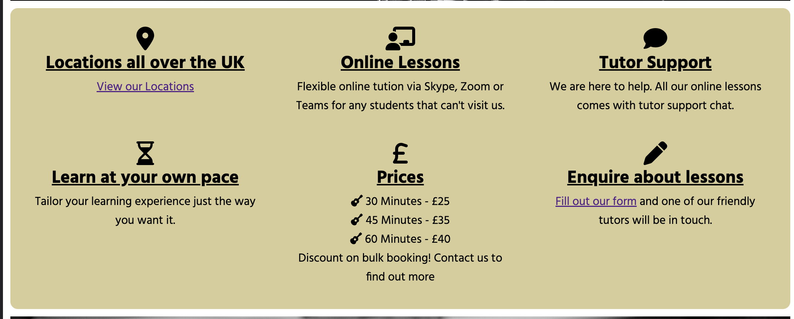

# The Guitar Guru's

  The Guitar Guru's website is a responsive website including all skills learnt throughout the course so far. It is a modern website that provides a service for people that are interested in the learning the guitar. It is advertised for all ages and abilities. It also offers a mixture of in person and online lessons to suit all customers.
  The website provides information to the user on what we offer, where we offer it and how we offer it. This will then give them all the information they need to decide whether or not they want to register their interest with us.

## Features

__Navigation Bar__

  - Featured on all pages, it is responsive to different screen sizes. For smaller devices the menu is located in a hamburger icon to the left, clicking this shows the drop down.
  - Larger screens will show the menu to the right in full text. 
  - The navigation bar includes links to the Home page, Locations Page, Register page and quick link to the contact us section on the footer of the home page. The nav bar is identical in each page to allow for easy navigation.
  - This section will allow the user to easily navigate from page to page across all devices without having to revert back to the previous page via the ‘back’ button.

__Nav Bar for Phone view__

__The landing page image__

  - The landing "Hero" image shows a black and white photo of someone playing the guitar with overlay text. This seperates the nav bar with the main content allowing flow and ease of reading on the website.It features overlay text which responds based on screen size.
  - This image is also shown on the "Locations" page for consistency on the web page.
  - The nav bar on mobile and larger screens shows the user the page they are on with an underline on the text.
  - On larger screens users can hover over a link which will underline temporarily showing them they can interact with the link.

__About Us section__

- The about us section is visibile on the landing page, clearly stating what the website is about and what it offers the reader. This helps the user know if they are in the right place for what they are wanting to achieve based on their search.

 __Home Page images__

- Keeping with the theme of black and white images on the home page. I used full width images as a background effect to break up sections to improve user experience and readability on the website.

__Overview__
  
- This section shows in a responsive grid view with icons and text. These are short and snappy bits of information to show the reader some important aspects of the Guitar Guru's and what they offer. 
- There are links located on the overview section for the locations page and the register your interest page. This means the user can navigate to other pages via this section as well as the nav bar.

__The Footer__
  - The footer section includes links to the relevant social media sites for The Guitar Guru's website. The links will open to a new tab to allow easy navigation for the user.
  - The footer is allows the user to see common icons and encourages them to keep connected via different social media platforms.

  ## Other Pages
  
  ### Locations

  - This page shows a the user all of our locations where we can teach in person. The locations are displayed in a responsive grid view with text and a background of the particular location. 
  - The grid will respond appropriately based on the screen size.
  - I ensured that the text colour and font worked well in front of the background image for ease of reading.
  - This page features the same hero image, nav bar and footer as all other pages.

### Register Your Interest

- This page has a form where anyone who is interested in signing up for lessons can fill in and submit. It has a mixture of text and radio button options which have been colured accordingly to the style. 
- The main "Get in Touch" button has a hover affect showing the user that is interactive.

### Features Left to Implement

- I'd like to make the locations page more interactive, taking the user to a dedicated page for the specific location they selected. This would then show them more detail around the location, including: Address, Contact Details, Tutors details. 
- Long term would have all of the online lesson material, including videos and interactive documents.

## Testing

### General

- I have tested this website using Chrome Dev Tools and viewing the page on different screen sizes to ensure that the website is responsive.
  
- I deployed the page to github in the early stages to monitor any hidden issues that were not showing on the browser preview.

### Nav Bar
  
- Does the Nav Bar dropdown work on mobile devices correctly and show all content. Does the page the user is current on show as underlined.

- Does the Nav Bar toggle work smoothly when looking at the site from Tablet view and smaller?

- Do all links take you to the correct page and does the 'Contact Us' button, take you to the 'Contact us' section on the Home page? 

### Home Page

- Does the hero image overlay text respond to screen size.
  
- Does the overview grid respond to different screen size. Column for mobile / 2 for tablet / 3 for laptops and larger

- Do the links in the overview for Locations and Fill in our form take the user to the correct pages.

### Locations

- Does the grid view react responsively on all screen sizes. Ensuring the images and text are displayed nicely and visible.

### Register your interest Form

- Please fill out the form correctly except do not enter your First Name. Try to Submit, and verify there is an error message.

- Please fill out the form correctly except do not enter your Last Name. Try to Submit, and verify there is an error message.

- Please fill out the form correctly except do not enter your email address, or enter an invalid email address. Try to Submit, and verify there is an error message.

- Submit (Get in touch) button works correctly. 

### Social Links

- Click on the Facebook, Twitter, Youtube and Instagram Icon in the footer and confirm it opens up the correct social page in a new tab.

### Validator Testing

- HTML
  - Checked all pages through the official [W3C validator] - I had issues with trailing slashes which CodeAnywhere seemed to add when saving and auto formatting. 
- CSS
  - No errors were found when passing through the official [W3C CSS Validation Service]
- Lighthouse
  - I ran my project through lighthouse to ensure the accessibility level was to a high standard on all pages.

## Deployment

- The site was deployed to GitHub pages during the creation of the site. During the learning time deploying the project earlier was advised. The steps to deploy are as follows:
  - In the GitHub repository, navigate to the Settings tab
  - From the source section drop-down menu, select the Master Branch
  - Once the master branch has been selected, the page will be automatically refreshed with a detailed ribbon display to indicate the successful deployment.

The live link can be found here - ![The Guitar Guru's] (https://philtipping31.github.io/PP1-TheGuitarGurus/)

## Credits

- I used [Figma](https://www.figma.com/google-fonts/montserrat-font-pairings/) to help with good font pairing options.
- My Mentor Alex Ford for giving great advise on different ways to implement images via view height. And just all round assitance.
- Other students and community leaders on Slack
- I gained some inspiration on how to display by website from the web page ![truefire.com] (https://truefire.com/online-guitar-lessons)

### Content

- The images were taken from both [Pixabay](https://pixabay.com/) and [Pexels](https://www.pexels.com/search/guitarist/)
- Instructions on how to implement the grids for the overview and locations were from [W3schools] (https://www.w3schools.com/css/css_grid.asp)
- The icons througout the site were taken from [Font Awesome](https://fontawesome.com/)

